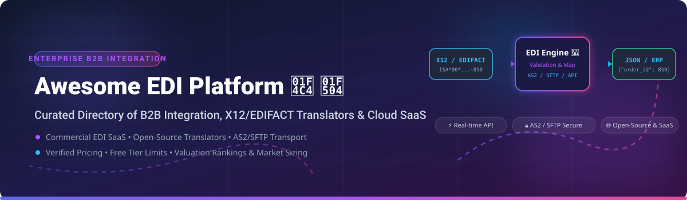

# Awesome-Electronic-Data-Interchange-Edi-Platform

# Awesome-Electronic-Data-Interchange-Edi-Platform 📄 🔄

  

  

  

  

  

  

  

---

## 🌟 Top Electronic Data Interchange (EDI) Platform Ecosystem

**Curated List of Commercial EDI Platforms & Open-Source EDI Translator Tools**  

*Focused on X12/EDIFACT Translation, AS2/SFTP Transport, Trading Partner Onboarding, ERP Integration & Self-Hosted EDI Processing*

**Last updated: October 2026** 📅

---

### 📌 Overview & SEO Summary

Welcome to the ultimate curated directory of **electronic data interchange platforms**, **open-source EDI translators**, and **B2B integration frameworks**. Whether you are looking for enterprise-grade commercial solutions (such as *SPS Commerce*, *TrueCommerce*, and *Orderful*), or self-hostable open-source alternatives (like *Bots EDI Translator* and *EdiWeave*), this list covers category leaders, partner onboarding, and privacy-respecting EDI processing.

**Key Market Context:**

- **Bots EDI Translator** is the **leading open-source EDI translator**, used by **700+ organizations** to process **hundreds of thousands of EDI messages per month**.

- **AWS B2B Data Interchange** provides **pay-as-you-go EDI transformation** at cloud scale, enabling X12 EDI to JSON/XML conversion with managed trading partner onboarding.

- **Cleo WebEDI Compliance Edition** starts at **$99/month** with **3 unique users**, while **Orderful Web EDI** starts at **$189/month per trading partner**.

---

## 📑 Table of Contents

- [🏢 SaaS & Commercial Platforms](#-saas--commercial-platforms)

- [🔓 Open-Source GitHub Projects](#-open-source-github-projects)

- [🛠️ How to Contribute](#%EF%B8%8F-how-to-contribute)

- [📊 Star History](#-star-history)

- [🤝 Support & Sponsorship](#-support--sponsorship)

- [⚠️ Disclaimer](#%EF%B8%8F-disclaimer)

---

## 🏢 SaaS / Commercial Platforms

The EDI platform market spans **hyperscaler-native EDI services** (AWS B2B Data Interchange) that provide **managed EDI transformation with pay-as-you-go pricing**, **full-service EDI providers** (SPS Commerce, TrueCommerce, Cleo) that handle **trading partner onboarding and compliance**, and **API-first modern EDI platforms** (Orderful, Stedi) that offer **developer-friendly APIs for EDI integration**. **Cleo WebEDI** starts at **$99/month** with **3 unique users**, **2,200+ prebuilt trading partner connections**, and **no VAN traffic charges**. **Orderful Web EDI** charges **$189/month per trading partner** with **100% EDI compliance**, **UCC 128 labels**, and **24/7 EDI support**. **Transalis** offers **flat monthly subscription with no per-message metering**, **no VAN traffic charges**, and **thousands of partner maps free to use**. **Boomi Pay-As-You-Go** starts at **$99/month** with a **flat rate of $0.05 per Boomi Message**.

| SaaS / Commercial Platform | Company / Owner | Valuation / Market Cap | Standard Edition Starting Price | Free Tier / Free Trial Limits | Description |

| :--- | :--- | :--- | :--- | :--- | :--- |

| **[AWS B2B Data Interchange](https://aws.amazon.com/b2b-data-interchange/)** ☁️ | Amazon | ~$2.0 Trillion | **Pay-as-you-go** (per document transformed) | **Free tier: limited** | **AWS-native EDI service** — **Fully managed EDI transformation and generation** at cloud scale. **X12 EDI to JSON/XML conversion** . **Low-code interface for managing trading partner relationships** . **Pay-as-you-go pricing with no upfront commitment** . |

| **[SPS Commerce](https://www.spscommerce.com/)** 🏢 | SPS Commerce | ~$5 Billion | **$20/month** (starting, per Software Advice) | **No free tier**; demo available | **Retail EDI network** — **The largest retail EDI network** with **80,000+ trading partners** . **Full-service onboarding and compliance** . **Retail-focused EDI for suppliers and retailers** . |

| **[TrueCommerce](https://www.truecommerce.com/)** 🔵 | TrueCommerce | Private | **$19.95/month** (starting, per Software Advice) | **No free tier**; demo available | **EDI and supply chain integration** — **End-to-end EDI solutions** for retail, consumer goods, and manufacturing. **71% of users recommend this product** . **Integrated with major ERP systems** . |

| **[Orderful](https://www.orderful.com/)** 🎯 | Orderful | Private | **$99/month** (Labels); **$189/month per trading partner** (Web EDI); **$399/month** (Integrated) | **Free trial available** | **Modern EDI API platform** — **API-first EDI for developers** . **100% EDI compliance with Web EDI** . **Enterprise tier for 20+ trading partners with RBAC, SSO, and managed integration services**. |

| **[Cleo](https://www.cleo.com/)** 🟢 | Cleo | Private | **$99/month** (Startup); **$90.75/month annual**  | **Free trial available** | **WebEDI compliance platform** — **2,200+ prebuilt trading partner connections**. **No KC fees, no 997 fees** . **Integrated plan adds custom mapping, workflow automation, and ERP integration** . |

| **[Boomi EDI](https://boomi.com/)** 🟣 | Boomi | ~$4 Billion | **$99/month** (Pay-As-You-Go); **$0.05/Message** | **Active trial users eligible**  | **Unified integration platform** — **EDI, Integration, Flow, API Management, and Data Hub** in one platform. **Connector capacity tiers with 10M messages per connector** per subscription year. |

| **[Babelway](https://www.babelway.com/)** 🔶 | Babelway | Private | **$0.01/month** (Basic, per TrustRadius) | **Free trial available** | **Cloud EDI and B2B integration** — **No setup fee** . **Modern web-based EDI platform** . |

| **[Stedi](https://www.stedi.com/)** ⚡ | Stedi | Private | **Custom pricing** (per transaction) | **Free tier available** | **EDI API platform** — **Developer-friendly EDI** with **API-first architecture** . **Modern alternative to legacy VANs** . |

| **[MuleSoft Anypoint Partner Manager](https://www.mulesoft.com/)** 🔴 | Salesforce | ~$250 Billion | **Custom enterprise pricing** (includes unlimited sandbox partners + up to 50 production partners) | **Demo available** | **API-led EDI integration** — **Anypoint Partner Manager** for **EDI and API integration** . **Unlimited sandbox partners** and **up to 50 production partners** . **Integrated with MuleSoft Anypoint Platform** . |

| **[Transalis](https://www.transalis.com/)** 🌐 | Transalis | Private | **Custom pricing** (flat monthly subscription) | **No free tier** | **Transparent EDI pricing** — **No VAN traffic charges, no character-count billing, no peak-season surcharges**. **Thousands of partner maps free to use** . **Flat monthly subscription with unlimited message volume** . |

---

## 🔓 Open-Source GitHub Projects

*Sorted by GitHub_Stars_Count (Descending)* 🌟

- **[Bots EDI Translator](https://github.com/bots-edi/bots)**   

  **The leading open-source EDI translator**, GPL-3.0 licensed. **Used by 700+ organizations** to translate **thousands of electronic documents every day**. **Any-to-any data format** — EDIFACT, X12, XML, JSON, SAP idoc, CSV, and fixed-width flat files . **Ready EDI definitions** for **120+ EDIFACT D96A documents** and popular X12 documents . **Simple data mapping with Python scripts** . **Web console for configuration and supervision** . **Built-in EDIFACT/X12 functional acknowledgments (CONTRL, 997)** . **Transport via (S)FTP, FTPS, POP3(S), IMAP(S), SMTP(S), HTTP(S), files, and XML-RPC** . **Cross-platform** — Windows, Linux, OSX, and Unix variants . **The definitive open-source EDI translator** . 🔄

- **[EdiWeave](https://github.com/EdiFabric/EdiWeave)**   

  **Open-source multi-platform EDI framework for .NET**, Apache-2.0 licensed. **Parse and create X12, HIPAA, EDIFACT, EANCOM, VDA, and PNRGOV documents**. **A hard-fork of the now closed-source EdiFabric** . **The most comprehensive open-source .NET EDI library** . ⚙️

- **[EdiReader](https://github.com/EdiFabric/EdiReader)**   

  **Flexible and lightweight EDI parser written in pure Java**, Apache-2.0 licensed. **Handled millions of transactions in a wide variety of products, services, industries, platforms, and custom integrations**. **Used in BerryWave EDI API and BerryWave Python EDI SDK** . **The most production-proven open-source Java EDI parser** . ☕

- **[smooks-edifact](https://github.com/smooks/smooks-edifact)**   

  **EDIFACT parsing and binding for Smooks**, Apache-2.0 licensed. **Java-based EDIFACT parser** . **Part of the Smooks data integration framework** . 🔧

- **[edifact-generator](https://github.com/php-edifact/edifact-generator)**   

  **Formatter for EDI messages in PHP**, GPL-3.0 licensed. **Generate EDIFACT messages from structured data** . **The most accessible PHP EDI generator** . 🐘

- **[edifact-parser](https://github.com/Chemaclass/edifact-parser)**   

  **A parser for UN/EDIFACT files in PHP**, MIT licensed. **Parse EDIFACT messages into structured arrays** . **Simple and lightweight** . 🎯

- **[java-edilib](https://github.com/edilib/java-edilib)**   

  **EDIFACT reader written in Java**, Apache-2.0 licensed. **Lightweight EDIFACT parsing for Java applications** . **Part of the edilib suite** . ☕

- **[go-edilib](https://github.com/edilib/go-edilib)**   

  **EDIFACT reader written in Go**, Apache-2.0 licensed. **High-performance EDIFACT parsing for Go applications** . **The most modern open-source EDI parser** . 🚀

- **[edi-schemas](https://github.com/adamkasztenny/edi-schemas)**   

  **Schemas for X12 and EDIFACT as JSON**, open-source. **JSON schemas for EDI validation** . **The standard for EDI schema definition** . 📋

- **[Open EDI](https://github.com/freight-trust/open-edi)**   

  **OAS3 EDI API for Translation and Validation**, Apache-2.0 licensed. **Transactional service with attestation and non-repudiation** . **Modern API-first EDI platform** . 🔌

- **[Delightful EDIFACT](https://github.com/sweet-delights/delightful-edifact)**   

  **EDIFACT data binding library and code generator**, open-source. **Generate type-safe EDIFACT bindings** . **Code generation for EDI schemas** . 🍬

---

## 🛠️ How to Contribute

Contributions are welcome! Follow these steps to submit new EDI platforms or open-source EDI translator software:

1. 🍴 **Fork** the repository.

2. 📝 **Add/edit** entries in `README.md` maintaining table/list structure and formatting.

3. 🔗 Include project title, official website/GitHub link, exact Stars_Count, license, and brief description.

4. 🚀 Submit a **Pull Request** with a descriptive summary of your changes.

---

## 📊 Star History

---

## 🤝 Support & Sponsorship

If you find this EDI platform repository useful, please consider supporting the project:

- ⭐ **Star** this repository to increase visibility!

- 🔀 **Fork** and share with fellow integration engineers, supply chain professionals, and open-source advocates.

- ☕ **Sponsor & Buy Me a Coffee**: Support ongoing open-source curation via the [GitHub Sponsor Dashboard](https://github.com/sponsors/ishandutta2007).

---

## ⚠️ Disclaimer

- This is a **community-curated** list — not exhaustive and not an endorsement. ℹ️

- **Cleo WebEDI starts at $99/month** with **3 unique users** and **no KC or 997 fees**. **Orderful Web EDI charges $189/month per trading partner** with **100% EDI compliance**. **Transalis offers flat monthly subscription with no per-message metering or VAN traffic charges**.

- **Bots EDI Translator is the leading open-source EDI translator** — used by **700+ organizations** processing **hundreds of thousands of messages per month**. **EdiWeave provides .NET EDI parsing** for X12, EDIFACT, EANCOM, and more.

- **Open-source EDI tools are not turnkey** — **Bots requires Python/Django deployment** with **grammar and mapping configuration**. **EdiWeave requires .NET development** . **Always validate EDI document validation and partner-specific compliance with a proof-of-concept** before production deployment . 📄

---

  <b>Made with ❤️ for integration engineers, supply chain professionals, and open-source EDI advocates.</b>

